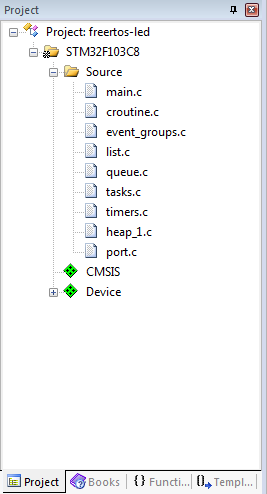

# Lab 6

## Lab 5 cont'd
Send commands to motor controller from the STM32 MCU.

- [Commands guide][motor]
- [Standard Peripherals Library (SPL)][spl] or [SPL][spl2]

## Configuration
- Download the FreeRTOS library http://www.freertos.org/
- Add FreeRTOS source library to your project folder. That library file is separated within a folder called FreeRTOS. In that folder is consist of these file:  


- Copy FreeRTOSConfig.h file from FreeRTOS demo file for STM32F103 using Keil (in folder CORTEX_STM32F103_Keil) to folder FreeRTOS\include in your project.
- Not all files in the portable folder is needed, you only need MemMang folder and RVDS\ARM_CM3 folder. The ARM_CM3 folder contains SysTick definitions for STM32F103 microcontroller.

- In the project explorer, add these FreeRTOS source files (as `Add Exsiting Files to Group 'Source'`):  


- Go to the Include Paths settings in the Options for Target dialog and add paths to the FreeRTOS header file:  


- Open FreeRTOSConfig.h file, then add this code for map map the FreeRTOS port interrupt handlers to the CMSIS standard names:
    ```c
    /* Definitions that map the FreeRTOS port interrupt handlers to their CMSIS 2 standard names. */
    #define vPortSVCHandler SVC_Handler
    #define xPortPendSVHandler PendSV_Handler
    #define xPortSysTickHandler SysTick_Handler
    ```

- Set your debugger to `Reset and Run`  


## Resources/documentation
- [Commands guide][motor]
- [SPL][spl] or [SPL (alt)][spl2]
- [FreeRTOS][freertos]

## Experiments
- Schedule motor movements through FreeRTOS

You'll use the functions

```c
xTaskCreate(taskFunction, taskNameString, stackDepth, pvParameters, priority, createdTaskHandle); // To schedule new tasks
vTaskStartScheduler(); // To start the scheduler and program execution (no need for an infinite loop then)
```

The first function can be called as:

```c
xTaskCreate(taskFuncPointer, (const char*) "Task Name", 128, NULL, 1, NULL);
```

for example. This configures stack depth at 128 and priority at 1, with no parameters passed to the task function (as a `void *`).

Task functions have the type:

```c
void task(void*);
```

## Citations
Adapted from: http://embeddedsystemengineering.blogspot.com/2016/04/arm-cortex-m3-stm32f103-tutorial.html

[motor]: https://www.pololu.com/docs/pdf/0J1/TReX.pdf
[spl]: http://stm32.kosyak.info/doc/index.html
[spl2]: https://www.st.com/content/ccc/resource/technical/document/user_manual/59/2d/ab/ad/f8/29/49/d6/DM00023896.pdf/files/DM00023896.pdf/jcr:content/translations/en.DM00023896.pdf
[freertos]: https://www.freertos.org/Documentation/FreeRTOS_Reference_Manual_V10.0.0.pdf